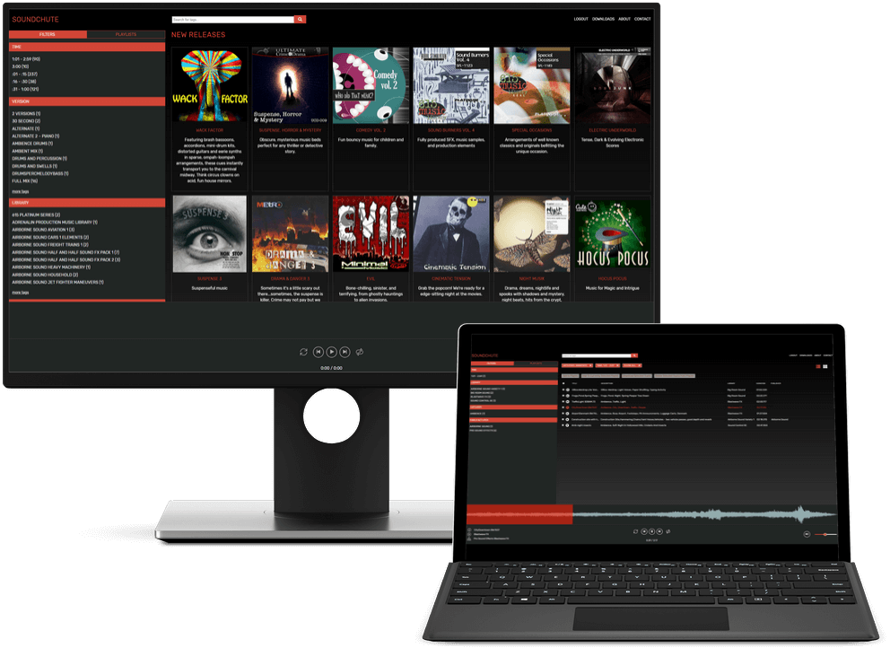
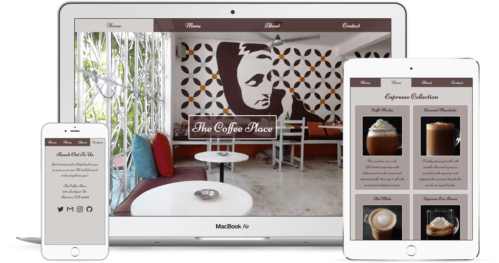
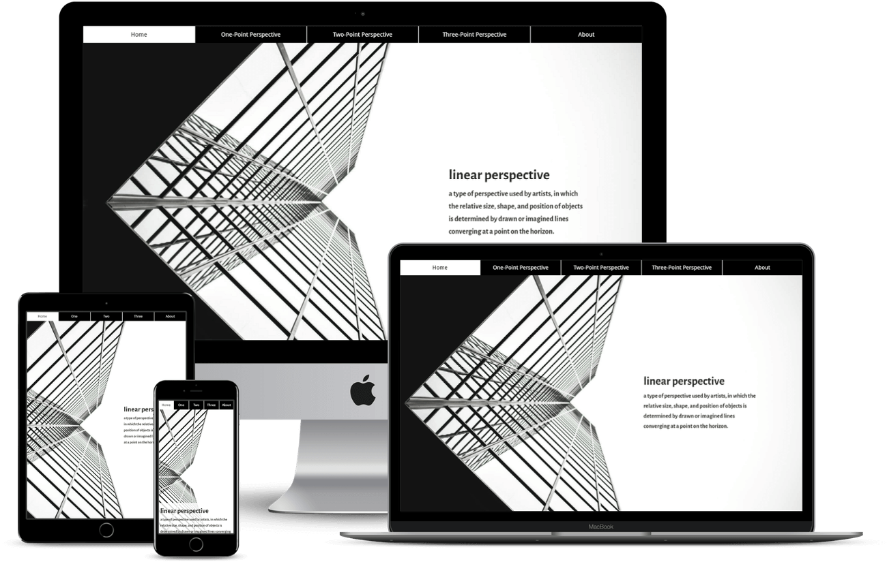
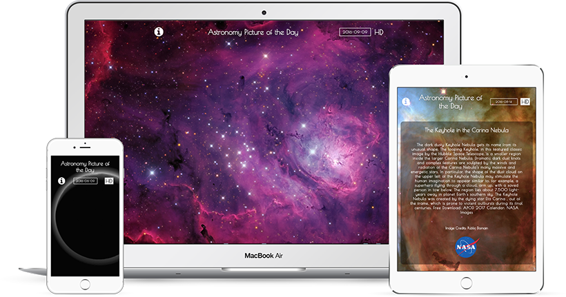
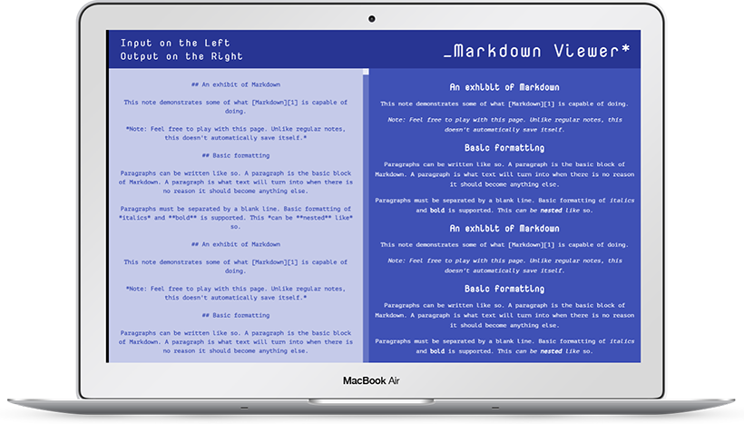
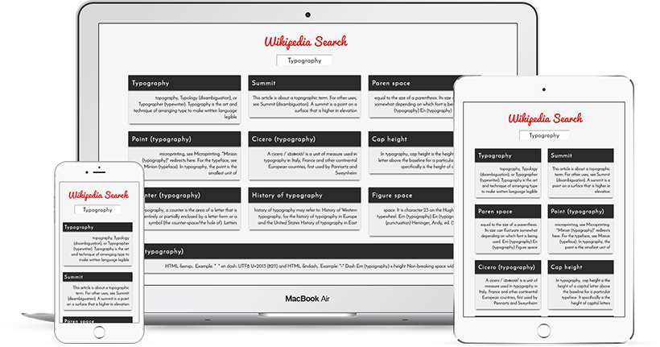
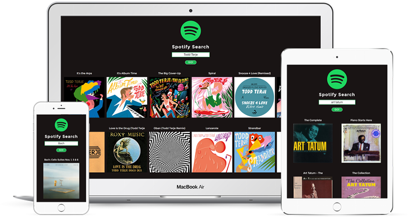
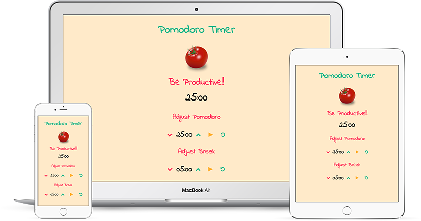

#  PROJECTS

## Soundminer Alloy (built with React, Redux, Web Audio API, Redux-Promise-Middleware, React-Router v4, Formik, Axios) 

Fetching data from the WordPress REST API for the Menu, About and Contact pages. Using Axios for API calls, redux-promise as the Redux middleware to resolve promises and React-Router-Dom (new in React-Router v4) for routing. Deployed using Zeit's Now. Background video taken from [coverr.co](https://coverr.co/)

 Alloy is a customizable and distributable web based search app that enables Soundminer users to access and
 use their audio files and playlists on the cloud. The project itself required a fast and easy to use UI combined
 with complete control of the backend API. 
        
 As the main frontend developer on Alloy, I designed and implemented the UI, was responsible for features such
 as text search, facet search/tag filtering, creating an audio waveform visualizer for the currently playing
 audio track, creation and manipulation of user playlists, with features such as downloading, deleting and
 adding tracks to the playlists and many more.
           
 The project is built with React, Redux and React-Router v4 among many other modern web technologies, and was
 a project that enabled me to merge my two passions, audio and UI development. 

### [More Info](https://soundchute.com/)

## The Coffee Place (built with React, Redux, Redux-Promise, React-Router v4, WordPress REST API, Axios) 

Fetching data from the WordPress REST API for the Menu, About and Contact pages. Using Axios for API calls, redux-promise as the Redux middleware to resolve promises and React-Router-Dom (new in React-Router v4) for routing. Deployed using Zeit's Now. Background video taken from [coverr.co](https://coverr.co/)

### [Demo](https://the-coffee-place-hetzshtewc.now.sh/) & [Source](https://github.com/berraknil/the-coffee-place) 

## Perspectives (built with React and React-Router v4) 

Built as a small multi-page project to start using React-Router v4 instead of v3. All text is taken from Wikipeda and images from Pixabay. Deployed using Zeit's Now.

### [Demo](https://perspectives-fzpyuvmnfh.now.sh/) &  [Source](https://github.com/berraknil/perspectives) 

## Twitch Clone (built with React, React-Router, React-Bootstrap) 

I used the Twitch (Kraken) Web API for this application. Built with React, using React-Router for directory routing and styled with React-Bootstrap. [Axios HTTP client](https://www.npmjs.com/package/axios) is used for the AJAX calls. 

### [Demo](http://twitch-clone.herokuapp.com/) &  [Source](https://www.github.com/berraknil/twitch-clone) 

## Astronomy Picture of the Day (jQuery, AJAX)

I used NASA's Astronomy Picture of the Day [API](https://apod.nasa.gov/apod/lib/about_apod.html) for this application. It relies on jQuery for the AJAX calls and for toggling the info and HD photo options, and the moment.js library for the date change functionality.

### [Demo](https://berraknil.github.io/nasa-apod) &  [Source](https://www.github.com/berraknil/nasa-apod) 

## Markdown Preview (React, Remarkable)

I built this markdown preview application using React and the additional Remarkable component. It has a built in ES6 template literal to show a sample text written with markdown on first load. This application only supports desktop and tablet layouts for the time being.

### [Demo](https://berraknil.github.io/markdown-viewer/) &  [Source](https://www.github.com/berraknil/markdown-viewer)

## Weather Application (jQuery, AJAX)

This application fetches forecast from the Weather Underground API and uses IP based geolocation. It displays a random nature photo in the background via the Unsplash API when the resolution is equal to a tablet or wider. A jQuery toggle is available for switching between Celsius and Fahrenheit.

### [Demo](https://codepen.io/berrak/full/54326c4b889b853402a56ae0531280bd/) &  [Source](https://www.github.com/berraknil/weather-app) 

## Wikipedia Search (jQuery, AJAX)

This Wikipedia search engine fetches results from the MediaWiki API by using the query entered on the search box. It uses jQuery for the AJAX calls and the search function.

### [Demo](https://berraknil.github.io/wikipedia-viewer) &  [Source](https://www.github.com/berraknil/wikipedia-viewer) 

## Spotify Search (built with React, SASS, ES6) 

I used the Spotify Web API for this application. Built with React and styled with SASS. [Axios HTTP client](https://www.npmjs.com/package/axios) is used for the AJAX calls. 

### [Demo](https://berraknil.github.io/spotify-react) &  [Source](https://www.github.com/berraknil/spotify-react) 

## Pomodoro Timer (Javascript)

This is a Pomodoro timer that is built with pure JavaScript. It is possible to change the duration of the Pomodoro and break times or restart the timers.

### [Demo](https://berraknil.github.io/pomodoro-app/) &  [Source](https://www.github.com/berraknil/pomodoro-app)

