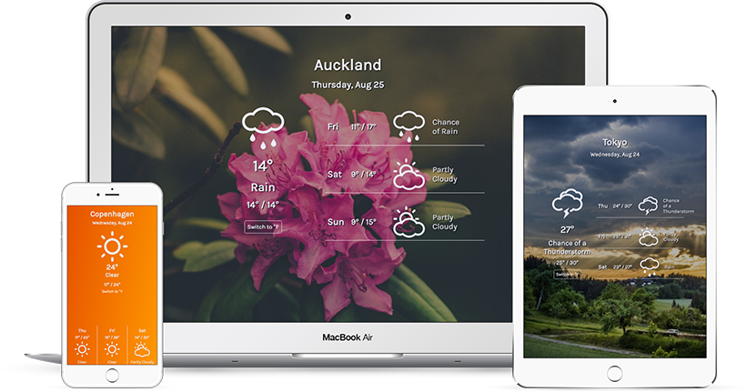

#  PROJECTS

## Spotify Search (built with React) 

I used the Spotify Web API for this application. It is built using React and styled with SASS. [Axios HTTP client](https://www.npmjs.com/package/axios) is used for the AJAX calls. 

### [Demo](https://berraknil.github.io/spotify-react) &  [Source](https://www.github.com/berraknil/spotify-react) 

## Astronomy Picture of the Day 

I used NASA's Astronomy Picture of the Day [API](https://apod.nasa.gov/apod/lib/about_apod.html) for this application. It relies on jQuery for the AJAX calls and for toggling the info and HD photo options, and the moment.js library for the date change functionality.

### [Demo](https://berraknil.github.io/nasa-apod) &  [Source](https://www.github.com/berraknil/nasa-apod) 

## Weather Application

This application fetches forecast from the Weather Underground API and uses IP based geolocation. It displays a random nature photo in the background via the Unsplash API when the resolution is equal to a tablet or wider. A jQuery toggle is available for switching between Celsius and Fahrenheit.

### [Demo](https://codepen.io/berrak/full/54326c4b889b853402a56ae0531280bd/) &  [Source](https://www.github.com/berraknil/weather-app) 

## Wikipedia Search

This Wikipedia search engine fetches results from the MediaWiki API by using the query entered on the search box. It uses jQuery for the AJAX calls and the search function.

### [Demo](https://berraknil.github.io/wikipedia-viewer) &  [Source](https://www.github.com/berraknil/wikipedia-viewer) 

## Markdown Preview

I built this markdown preview application using React and Remarkable libraries. It has a built in ES6 template literal to show a sample text written with markdown on first load. This application only supports desktop and tablet layouts for the time being.

### [Demo](https://berraknil.github.io/markdown-viewer/) &  [Source](https://www.github.com/berraknil/markdown-viewer)

## Pomodoro Timer

This is a Pomodoro timer that is built with pure JavaScript. It is possible to change the duration of the Pomodoro and break times or restart the timers.

### [Demo](https://berraknil.github.io/pomodoro-app/) &  [Source](https://www.github.com/berraknil/pomodoro-app)

